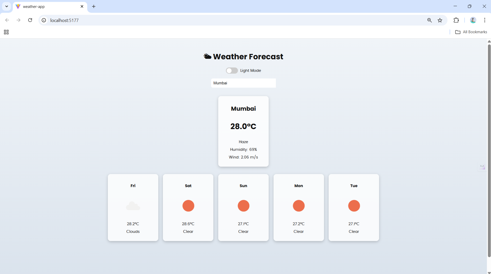

Weather App 🌤️

A responsive and interactive Weather Forecast Application built with React. Get real-time weather details and a 7-day forecast for any city, with a beautiful Light/Dark mode.

✅ Features

🌍 Search weather by city

🌤️ Real-time current weather

📅 7-day advanced forecast

🌗 Light/Dark theme toggle

📱 Fully responsive design

⚡ Fast performance using Vite

📸 Screenshots

---

🛠️ Installation

Clone the repository
git clone [https://github.com/irohitbatra/weather-app](https://github.com/irohitbatra/weather-app)

cd weather-app

Install dependencies
npm install

Run the app
npm run dev

Open the URL shown in terminal (usually http://localhost:5173
)

🔑 API Usage

This app uses OpenWeatherMap APIs:

Direct Geocoding API

One Call Weather API

Replace your API key in App.jsx:

const API_KEY = "YOUR_API_KEY";

⚠️ Avoid exposing API keys publicly. Use environment variables in production.

🧩 Tech Stack

React

Vite

JavaScript (ES6+)

CSS / Custom UI

🚀 How to Use

Enter a city name in search

Select from dropdown results

Get instant weather + weekly forecast

Switch between Light/Dark mode

🤝 Contributing

Pull requests and improvements are welcome!

License

This project is licensed under the MIT License.

Made with ❤️ by Rohit Batra
